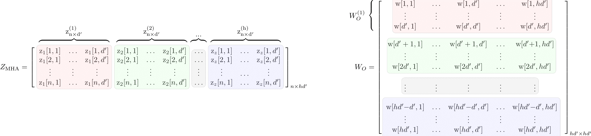
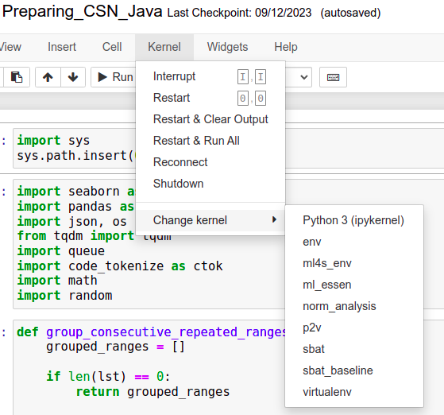
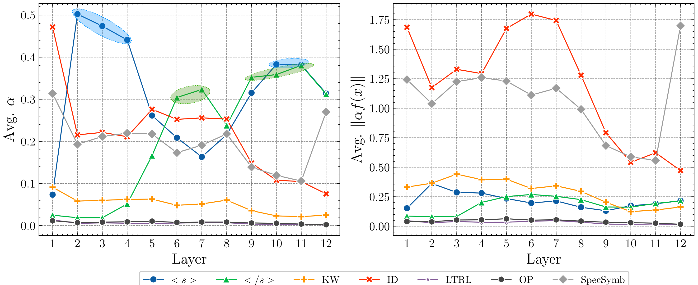
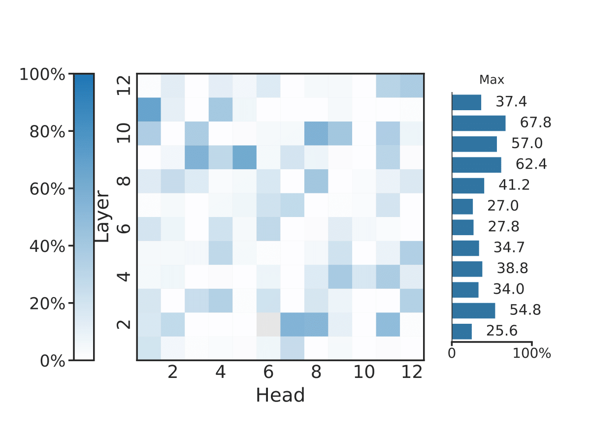
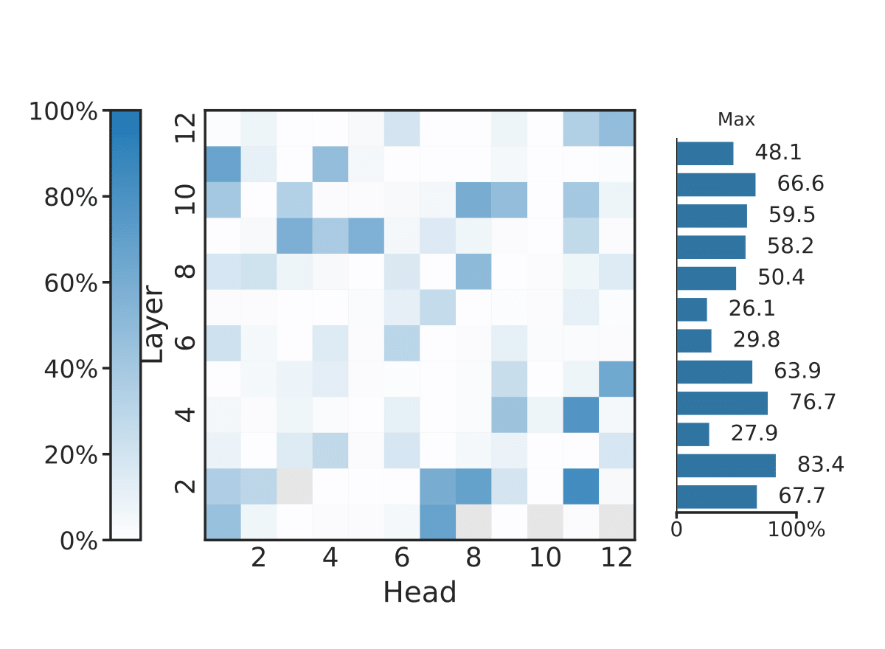

# Naturalness of Attention: Revisiting Attention in Code Language Models (ICSE'24 NIER)
[](https://doi.org/10.5281/zenodo.10439287)

## Abstract
> Language models like CodeBERT have advanced source code representation learning, but their opacity poses barriers to understanding what properties they capture. Recent attention analysis studies provide initial interpretability insights by focusing solely on attention weights rather than considering the complete context modeling of Transformers. 
The goal of this study is to shed some light on the previously ignored factors of the attention mechanism, beyond the attention weights.
We conduct an initial empirical study analyzing both attention distributions and transformed representations in CodeBERT. Across two programming languages, Java and Python, we find that the scaled transformation norms of the input better capture syntactic structure compared to attention weights alone. Our analysis reveals characterization of how CodeBERT embeds syntactic code properties. The findings demonstrate the importance of incorporating factors beyond just attention weights for rigorously understanding neural code models. This lays the groundwork for developing more interpretable models and effective uses of attention mechanisms in program analysis.



## Purpose
The purpose of the artifact is to replicate the results stated in the paper. The main goal of this study is to shed some light on the previously ignored factors of the attention mechanism, beyond the attention weights. Through this artifact evaluation we would like to apply for the badges _Available_ and _Reusable_. The reasons we believe that these badges are relevant to this artifact are as follow; first, all of the source code that is used in this artifact is publicly available. It include code that was used to generate and transform input data and the logic for extracting the attention and scaled attention maps. Second, the code is written in a way that it can be easily replicated by other researchers by following the steps that are mentioned later in the README.

## Provenance
The preprint of the paper is available [here](https://arxiv.org/abs/2311.13508), as for the code and data, they are available is this repository.

## Replication Package (Data, Setup and Usage)

### Structure
This repository contains the code and data needed to replicate the study. The main folders of this repository is described as follow,
- `custom_transformers`: This folder contains the modified implementation of `modelling_roberta.py` from the `transformers` library, based on Kobayashi _et al._ [work](https://github.com/gorokoba560/norm-analysis-of-transformer). It is used to generate maps of $||f(x)||$ and $||\alpha f(x)||$ along with the attention maps from each head.
- `data`: Contains the input data that was used in this study. We directly provide the input data for convenience, but, can generate it from scratsh following the steps that will be mentioned later.
- `notebooks`: Notebooks that were used to preprocess the raw data into input data are located here.
- `raw_data`: Data that will be preprocessed to obtain the input data. As mentioned in the paper, we used two corpora (Python and Java) from CodeSearchNet (CSN). The raw data for the Java corpus is seeded by randomly sampling 65K samples from CSN. You can download the set from the original repository [here](https://github.com/github/CodeSearchNet#data) and sample your own seed, or you can directly use our provided sample `csn_java_65k.jsonl`. As for the Python dataset (`train.json`), we used Wan _et al._'s given that it already contains the property map.
- `scripts`: The implementation of the logic needed to extract data to answer RQ1 and RQ2.
- `visualization`: Includes the notebooks needed to generate figures 2, 3 and 4 in the manuscript.
- `results`: The destination folder where the results of RQ1 and RQ2 will be saved. `java` and `python` will contain the results of RQ1, whereas the root folder (i.e., `results`) will contain the results of RQ2. We also provide the results data direclty for convenience.

### Dependencies
For this small, self-contained codebase, virtualenv provides a lightweight way to manage dependencies and distribute the code. Docker or VMs would add unnecessary complexity. Virtualenv encapsulates the Python environment without the configuration and size overhead of containers or VMs. It ensures portability and reproducibility while maintaining simplicity for this study.  
First, create virtual environment to install the dependencies,  
```console
python3 -m venv norm_analysis
```
Second, activate the virtual environment (if you are using a Linux distribution or macOS),
```console
source ~/norm_analysis/bin/activate
``` 
In case you are using a Windows OS,  
```console
norm_analysis\Scripts\activate
```  
After executing these commands, you should see `(norm_analysis)` in your terminal, and a folder with the same name created at the root level of the repository.

Then, these dependencies can be installed by executing,   
```console
pip install -r requirements.txt
```

The final step is to add the virtual enviornment to Jupyter Notebook. This is done by executing the following command. Make sure that the virtual enviornment is activated when doing so.

```console
pip install --user ipykernel
```
```console
python -m ipykernel install --user --name=norm_analysis
```
If you face an issue while executing the two above commands, try setting `include-system-site-packages` in `norm_analysis/config.cfg` to `true`.  
To execute the notebooks, execute the following command,
```console
jupyter notebook
```
and do not forget to choose the added virtual enviornment  

### Hardware Specification
The hardware specification used for this study is as follows,  
- OS: Debian GNU/Linux 11 (bullseye)
- CPU: Intel(R) Core(TM) i7-8700 CPU @ 3.20GHz
- GPU: NVIDIA GeForce RTX 2080 (8GB VRAM)
- RAM: 32 GB
- Storage: 10 GB

Most of the logic is implemented in `scripts/RQ1.py`. It is used to generate the data needed for both RQs. We only perform a one forward pass (i.e., inference), and no backpropagation is needed. It took approximately 25 minutes to run the RQ1 script under the hardware mentioned above, so it is expected to take less if it is run on a higher end GPU. Note that a GPU is not required to execute this artefact which can be fully executed in a CPU. However, this would increase the overall execution time.  
The total size of data that includes raw data, processed input data and model weights (downloaded in the background by `huggingface` library) is around 1.5 GB. So, a machine with a storage of 10 GB should be sufficient to run the study.

### Data Preprocessing
In this step we performed some minor data preprocessing. The major preprocessing steps are: removing comments (line and block), and discarding samples that cannot be parsed by [code_tokenize](https://github.com/cedricrupb/code_tokenize) which constituted $< 7.7\%$ of the total set of instances in the raw datasets. We used `code_tokenize` to tokenize source code into tokens and group them by category.  
Execute the notebooks `Preparing_CSN_Java.ipynb` and `Preparing_CSN_Python.ipynb` to generate the data needed for the study. Upon successfull execution, `5k_csn_java.jsonl` and `5k_csn_python.jsonl` will be generated and stored in the `data` folder. **Note that these files are already included if you want to skip this step**.

### Generating Data for RQs
To generate the data needed to answer RQ1 and RQ2, execute the following command,  
```console
python3 -m scripts.RQx.py
```  
where `x` is `1` or `2` depending on the RQ. The results of RQ1 will be stored in `results/java` and `results/python`, whereas the results of RQ2 will be directly saved as `.pickle` files in `results`.  
Finally, to generate the visualizations that were used to study the difference between the components of the MHA (_i.e.,_ $\alpha$, $f(x)$ and $\alpha f(x)$), execute the Jupyter notebooks `RQ1.ipynb` and `RQ2.ipynb` located in the `visualization` folder.

### RQ Figures

All figure generated and presented in the manuscript are also provided in the `figures` folder.

##### Trend Analysis $\alpha$ vs $||\alpha f(x)||$

Python             |  Java
:-------------------------:|:-------------------------:
  |  

##### Cancelling Effect between $\alpha$ and $||f(x)||$ (Example: \<s\> token)

$\alpha$             |  $\|\|f(x)\|\|$
:-------------------------:|:-------------------------:
  |  


##### Syntactic Alignment
Attention Weights             |  Scaled Norms
:-------------------------:|:-------------------------:
  |  